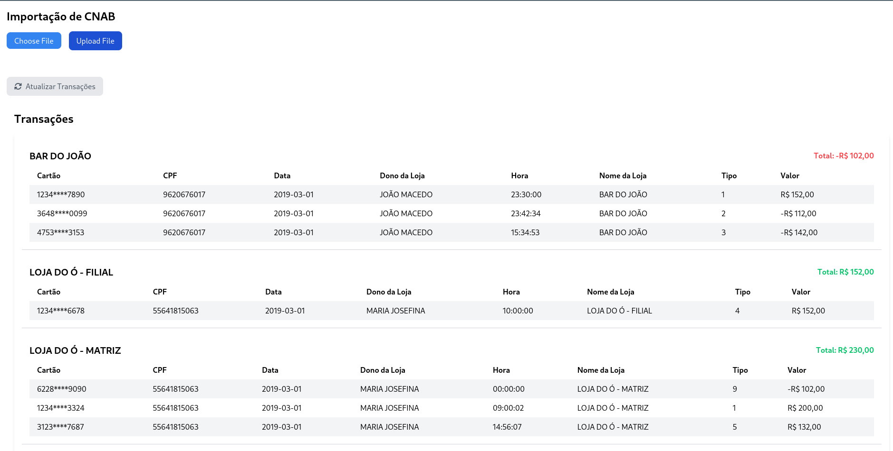

# Data Engineering

## SpringApp and ReactApp

### Running project:

- Make sure you have [Docker](https://www.docker.com/) installed on your machine

- Clone this project
  ```bash
  git clone https://github.com/clebsonsantos/data-engineering.git
  ```

- Enable initialization file
  ```bash
  chmod +X init.sh
  ```

- Execute file
  ```bash
  ./init.sh
  ```

### Preview Front-end:

- [Access Front-End](http://localhost:9090)



### Routers for Back-end:

- GET
  ```curl
    curl --location 'http://localhost:8080/transactions'

  ```


- POST
  ```curl
    curl -X POST -F "file=@CNAB.txt" http://localhost:8080/cnab/upload

  ```

### Technologies:
 
- [Spring Boot](https://spring.io/projects/spring-boot)
- [Spring MVC](https://docs.spring.io/spring-framework/reference/web/webmvc.html)
- [Spring Data JDBC](https://spring.io/projects/spring-data-jdbc)
- [Spring Batch](https://spring.io/projects/spring-batch)
- [Vite](https://vitejs.dev)
- [React](https://pt-br.react.dev)
- [Tailwind](https://tailwindcss.com)
- [PostgreSql](https://www.postgresql.org/)

### Architectural Decisions:

- Uniqueness control of transactions is done per CNAB file, which means that transaction processing is done only once per file.
- The CNAB file must be named with an id or timestamp, as it will be passed as a job parameter and can only be imported once.
- If a file is already imported, an error message must be sent to the user.
- If there is an error in processing, it is possible to submit the same file several times to enable the restart where processing stopped.
- If the file is very large, it is possible to use a partitioning strategy in the job, thus improving performance.

### Note: 

This application is based in another application located [here](https://github.com/giuliana-bezerra/desafio-backend-pagnet).